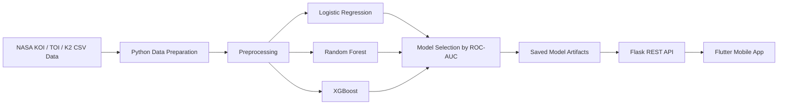

<div align="center">

# NasaSpaceApp

### A machine-learning and Flutter-based exoplanet candidate analysis prototype built around NASA datasets

[Türkçe](README.md) · English


</div>

<div align="center">

## Demo Video

[](https://youtu.be/sWxy0WPtT_A)

</div>

---

## Overview

**NasaSpaceApp** is an end-to-end prototype that uses tabular observations from NASA exoplanet archives to estimate whether an observed object is a planet candidate or a false positive.

The project contains three main components:

- A Python machine-learning pipeline that prepares Kepler, TESS, and K2 data and compares classification models
- A Flask REST API that exposes the trained model to a mobile client
- A Flutter application with prediction, confidence, light-curve, comparison, saving, and sharing workflows

This project is not a scientifically validated replacement for the astronomical confirmation process. It is an educational and portfolio prototype combining space data, machine learning, API development, and mobile visualization.

---

## Key Features

### Machine Learning

- Combines Kepler KOI, TESS TOI, and K2 tables under a shared feature schema
- Builds a binary target from Confirmed/Candidate and False Positive labels
- Median imputation for missing values
- Standard scaling for numerical features
- Comparison of Logistic Regression, Random Forest, and XGBoost
- Accuracy, Precision, Recall, F1, and ROC-AUC evaluation
- Saves the selected model, preprocessor, and feature list as `.pkl` files

### Mobile Application

- Planet-candidate scanning workflow
- Prediction result and confidence score
- Planet-type classification
- Habitable-zone assessment
- Light-curve simulation and chart view
- Comparison with Earth
- Saved results
- Result sharing
- Discovery-story screen
- Space-themed dark interface

### API

- Single prediction
- Batch prediction
- Feature-list endpoint
- Health check
- Light-curve simulation
- Earth comparison

---

## System Architecture



---

## Data

The project is organized around the following data sources:

- **KOI:** Kepler Objects of Interest
- **TOI:** TESS Objects of Interest
- **K2:** K2 planet and candidate records

The training pipeline maps features such as orbital period, transit duration, transit depth, radius ratio, planet radius, stellar radius, stellar density, magnitude, signal-to-noise ratio, insolation, and equilibrium temperature into a shared tabular representation.

> The CSV files in the repository are snapshots downloaded on specific dates. Column names and record counts may differ in newer releases.

---

## Modeling Approach

1. Columns from different missions are mapped to shared feature names.
2. Confirmed and Candidate records are mapped to the positive class, while False Positive records are mapped to the negative class.
3. The dataset is divided with a stratified train/test split.
4. Missing values are imputed with the median and features are standardized.
5. Multiple classifiers are evaluated on the same test set.
6. The model with the highest ROC-AUC score is saved.

The original project notes report test accuracy above `90%`. Because the repository does not include a fixed evaluation report, exact performance should be reproduced for the selected dataset snapshots and environment.

---

## API Endpoints

```text
GET  /
GET  /api/health
GET  /api/features
POST /api/predict
POST /api/batch_predict
POST /api/simulation/light_curve
POST /api/planet/comparison
```

---

## Project Structure

```text
NasaSpaceApp/
├── flutterNasa/
│   ├── lib/
│   │   ├── models/
│   │   ├── screens/
│   │   ├── services/
│   │   ├── theme/
│   │   ├── widgets/
│   │   └── main.dart
│   └── pubspec.yaml
├── spyderNasa/
│   ├── models/
│   │   ├── best_model.pkl
│   │   ├── feature_list.pkl
│   │   └── preprocessor.pkl
│   ├── combine_data.py
│   ├── exoplanet_tabular_pipeline.py
│   ├── mobile_api.py
│   ├── prediction.py
│   ├── smart_csv_reader.py
│   └── visualization.py
└── README.md
```

---

## Installation and Usage

### 1. Python API

```bash
git clone https://github.com/BurakKocDev/NasaSpaceApp.git
cd NasaSpaceApp/spyderNasa

pip install flask flask-cors pandas numpy scikit-learn joblib xgboost
python mobile_api.py
```

Train the model first when the model artifacts are unavailable:

```bash
python exoplanet_tabular_pipeline.py
python mobile_api.py
```

The API runs at:

```text
http://localhost:5000
```

### 2. Flutter Application

```bash
cd ../flutterNasa
flutter pub get
flutter run
```

Update the API address in the mobile project for your development environment:

```dart
static const String baseUrl = 'http://YOUR_LOCAL_IP:5000';
```

For many Android-emulator setups, the host machine's localhost can be reached through `10.0.2.2`.

---

## Technology Stack

### Mobile

- Flutter
- Dart
- Material Design
- HTTP
- SharedPreferences
- Share Plus
- FL Chart

### Backend and Data Science

- Python
- Flask
- Flask-CORS
- Pandas
- NumPy
- scikit-learn
- XGBoost
- joblib
- Matplotlib
- Seaborn

---

## Limitations

- Some inputs on the mobile scanning screen are selected from predefined sample datasets.
- The light curve and several stellar or planetary properties are simulated or rule-based.
- Mapping Candidate records to the positive class simplifies the distinction between candidates and scientifically confirmed planets.
- Results must not be treated as astronomical confirmation or a real discovery announcement.
- The mobile API address is configured for a local network and must be changed across environments.
- This project was developed for learning, prototyping, and portfolio purposes.

---

## Goal

NasaSpaceApp combines open astronomy data preparation, machine-learning classification, REST API delivery, and mobile visualization in a single end-to-end project.
