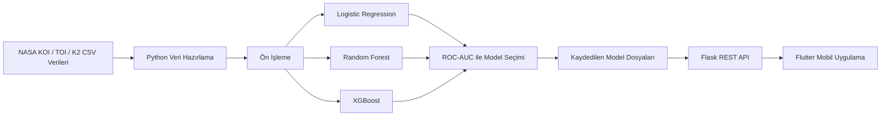

<div align="center">

# NasaSpaceApp

### NASA ötegezegen verileriyle çalışan makine öğrenmesi ve Flutter tabanlı gezegen adayı analiz prototipi

Türkçe · [English](README.en.md)


</div>

<div align="center">

## Demo Videosu

[](https://youtu.be/sWxy0WPtT_A)

</div>

---

## Proje Hakkında

**NasaSpaceApp**, NASA ötegezegen arşivlerinden alınan tablosal gözlem verilerini kullanarak bir gökcisminin gezegen adayı veya yanlış pozitif olma olasılığını analiz eden uçtan uca bir prototiptir.

Proje üç ana bileşenden oluşur:

- Kepler, TESS ve K2 verilerini hazırlayan ve modelleri karşılaştıran Python makine öğrenmesi hattı
- Eğitilmiş modeli mobil istemciye sunan Flask REST API
- Tahmin, güven skoru, ışık eğrisi, karşılaştırma ve kayıt ekranlarını içeren Flutter uygulaması

Bu çalışma, bilimsel keşif sürecinin yerini alan doğrulanmış bir astronomi sistemi değil; uzay verileri, makine öğrenmesi ve mobil uygulama geliştirmeyi bir araya getiren eğitim ve portföy amaçlı bir prototiptir.

---

## Temel Özellikler

### Makine Öğrenmesi

- Kepler KOI, TESS TOI ve K2 tablolarını ortak özellik yapısında birleştirme
- Confirmed/Candidate ve False Positive etiketlerinden ikili sınıflandırma oluşturma
- Eksik değerleri medyan ile tamamlama
- Sayısal özellikleri standartlaştırma
- Logistic Regression, Random Forest ve XGBoost modellerini karşılaştırma
- Accuracy, Precision, Recall, F1 ve ROC-AUC metriklerini hesaplama
- En iyi modeli, ön işlemciyi ve özellik listesini `.pkl` formatında kaydetme

### Mobil Uygulama

- Gezegen adayı tarama akışı
- Tahmin sonucu ve güven skoru
- Gezegen tipi sınıflandırması
- Yaşanabilir bölge değerlendirmesi
- Işık eğrisi simülasyonu ve grafik ekranı
- Dünya ile özellik karşılaştırması
- Kaydedilen sonuçlar
- Sonuç paylaşımı
- Keşif hikâyesi ekranı
- Uzay temalı karanlık arayüz

### API

- Tekil tahmin
- Toplu tahmin
- Model özelliklerini listeleme
- Sağlık kontrolü
- Işık eğrisi simülasyonu
- Dünya karşılaştırması

---

## Sistem Mimarisi



---

## Kullanılan Veriler

Proje aşağıdaki veri kaynaklarına göre hazırlanmıştır:

- **KOI:** Kepler Objects of Interest
- **TOI:** TESS Objects of Interest
- **K2:** K2 planet and candidate records

Eğitim hattında yörünge periyodu, geçiş süresi, geçiş derinliği, gezegen-yıldız yarıçap oranı, gezegen yarıçapı, yıldız yarıçapı, yıldız yoğunluğu, parlaklık, sinyal-gürültü oranı, ışınım ve denge sıcaklığı gibi tablosal özellikler ortak bir şemada birleştirilir.

> Veri dosyaları repository içinde belirli indirme tarihlerine ait anlık görüntülerdir. Güncel veri sürümlerinde kolon adları veya kayıt sayıları değişebilir.

---

## Modelleme Yaklaşımı

1. Farklı görevlerden gelen kolonlar ortak özellik adlarına eşlenir.
2. Confirmed ve Candidate kayıtları pozitif; False Positive kayıtları negatif sınıfa dönüştürülür.
3. Veri stratified train/test split ile ayrılır.
4. Eksik değerler medyan ile tamamlanır ve özellikler ölçeklendirilir.
5. Birden fazla sınıflandırıcı aynı test kümesi üzerinde değerlendirilir.
6. En yüksek ROC-AUC değerine sahip model kaydedilir.

Eski proje notlarında test çalışmalarında `%90+` doğruluk elde edildiği belirtilmektedir. Repository sabit bir sonuç raporu içermediği için kesin performans değeri kullanılan veri sürümü ve çalışma ortamına göre yeniden üretilmelidir.

---

## API Endpoint'leri

```text
GET  /
GET  /api/health
GET  /api/features
POST /api/predict
POST /api/batch_predict
POST /api/simulation/light_curve
POST /api/planet/comparison
```

---

## Proje Yapısı

```text
NasaSpaceApp/
├── flutterNasa/
│   ├── lib/
│   │   ├── models/
│   │   ├── screens/
│   │   ├── services/
│   │   ├── theme/
│   │   ├── widgets/
│   │   └── main.dart
│   └── pubspec.yaml
├── spyderNasa/
│   ├── models/
│   │   ├── best_model.pkl
│   │   ├── feature_list.pkl
│   │   └── preprocessor.pkl
│   ├── combine_data.py
│   ├── exoplanet_tabular_pipeline.py
│   ├── mobile_api.py
│   ├── prediction.py
│   ├── smart_csv_reader.py
│   └── visualization.py
└── README.md
```

---

## Kurulum ve Çalıştırma

### 1. Python API

```bash
git clone https://github.com/BurakKocDev/NasaSpaceApp.git
cd NasaSpaceApp/spyderNasa

pip install flask flask-cors pandas numpy scikit-learn joblib xgboost
python mobile_api.py
```

Model dosyaları bulunmuyorsa önce eğitim hattını çalıştırın:

```bash
python exoplanet_tabular_pipeline.py
python mobile_api.py
```

API varsayılan olarak aşağıdaki adreste çalışır:

```text
http://localhost:5000
```

### 2. Flutter Uygulaması

```bash
cd ../flutterNasa
flutter pub get
flutter run
```

Mobil uygulamadaki API adresi geliştirme ortamına göre güncellenmelidir:

```dart
static const String baseUrl = 'http://YOUR_LOCAL_IP:5000';
```

Android emülatörü kullanılırken çoğu yerel kurulumda bilgisayarın localhost adresine erişmek için `10.0.2.2` kullanılabilir.

---

## Kullanılan Teknolojiler

### Mobil

- Flutter
- Dart
- Material Design
- HTTP
- SharedPreferences
- Share Plus
- FL Chart

### Backend ve Veri Bilimi

- Python
- Flask
- Flask-CORS
- Pandas
- NumPy
- scikit-learn
- XGBoost
- joblib
- Matplotlib
- Seaborn

---

## Sınırlılıklar

- Mobil tarama ekranındaki bazı girişler örnek veri setlerinden seçilir.
- Işık eğrisi ve bazı yıldız/gezegen özellikleri simülasyon veya kural tabanlı hesaplamalardır.
- Candidate kayıtlarının pozitif sınıfa dahil edilmesi, bilimsel olarak doğrulanmış gezegen ile aday gezegen ayrımını sadeleştirir.
- Sonuçlar astronomik doğrulama veya gerçek keşif ilanı amacıyla kullanılmamalıdır.
- API adresi uygulama kodunda yerel ağ adresi olarak yapılandırılmıştır ve farklı ortamlarda güncellenmesi gerekir.
- Proje eğitim, prototipleme ve portföy amacıyla geliştirilmiştir.

---

## Amaç

NasaSpaceApp; açık astronomi verilerinin hazırlanması, makine öğrenmesiyle sınıflandırılması, REST API üzerinden sunulması ve mobil bir arayüzde görselleştirilmesi süreçlerini tek bir uçtan uca projede birleştirir.
